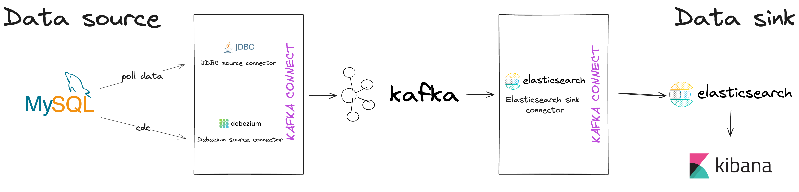

# Kafka Connect
## Introduction
This repository provides a step-by-step guide to set up Kafka Connect. Kafka Connect is a framework to stream data between Apache Kafka and other systems in a reliable and scalable way.

## Architecture

## Installation

---
### Prerequisites
- Docker
- Docker Compose
---

### Step 1: Clone project
```bash 
git clone https://github.com/quangpn24/kafka-learning.git 
```
Then move to Kafka Connect directory 
```bash
cd kafka-learning/kafka-connect
```
### Step 2: Run docker-compose
```bash
docker-compose up -d
```

### Step 3: Setup connector
1. **Source connector**

Use [Debezium source connector](https://docs.confluent.io/kafka-connectors/debezium-mysql-source/current/overview.html)
```bash
curl -X POST -H "Content-Type: application/json" --data @source/debezium/mysql-user-source.json http://localhost:8083/connectors
```

OR [JDBC source connector](https://docs.confluent.io/kafka-connectors/jdbc/current/source-connector/overview.html)
```bash
curl -X POST -H "Content-Type: application/json" --data @source/jdbc/mysql-task-source.json http://localhost:8083/connectors
```
2. **Sink connector**

 Use [Elasticsearch sink connector](https://docs.confluent.io/kafka-connectors/elasticsearch/current/overview.html)

For Debezium source connector
```bash
curl -X POST -H "Content-Type: application/json" --data @sink/elasticsearch/es-user-sink-for-debezium.json http://localhost:8083/connectors
```

For JDBC source connector
```bash
curl -X POST -H "Content-Type: application/json" --data @sink/elasticsearch/es-task-sink-for-jdbc.json http://localhost:8083/connectors
```

### Step 4: Initialize Elasticsearch index
With Debezium source connector
```bash
curl -i -X PUT -u "elastic:elasticpass" -H "Accept:application/json" -H  "Content-Type:application/json" http://localhost:9200/debezium.cdc.users -d @indexes/user-index.json
```
With JDBC source connector
```bash
curl -i -X PUT -u "elastic:elasticpass" -H "Accept:application/json" -H  "Content-Type:application/json" http://localhost:9200/jdbc.test-kafka-connect.tasks -d @indexes/task-index.json
```

### Step 5: Setup password for account `kibana_system`
```bash
docker compose exec elastic sh
```
Then run
```bash
curl -X POST -u "elastic:${ELASTIC_PASSWORD}" -H "Content-Type: application/json" http://localhost:9200/_security/user/kibana_system/_password -d "{ \"password\": \"${KIBANA_PASSWORD}\" }"
```
After that, you can access Kibana at `http://localhost:5601` with username `your_username` (default: `elastic`) and password `your_password`.

### Step 6: Initialize Database
First, you need to access your database.

Then, create tables with the following schema:
```sql 
//use for Debezium source connector
CREATE TABLE users (
   id int AUTO_INCREMENT PRIMARY KEY,
   username varchar(256),
   age integer,
   email varchar(256),
   created_at timestamp DEFAULT CURRENT_TIMESTAMP,
   updated_at timestamp DEFAULT CURRENT_TIMESTAMP
); 
```
and 
```sql
//use for JDBC source connector
CREATE TABLE tasks (
  id int AUTO_INCREMENT PRIMARY KEY,
  title varchar(256),
  status varchar(256),
  created_at timestamp DEFAULT CURRENT_TIMESTAMP,
  updated_at timestamp DEFAULT CURRENT_TIMESTAMP
);
```

### Step 7: Check result
Insert data into the table you have created in step 6.
Then, you access `Kibana` to see the result.

---
And that's all you need to set up Kafka Connect. Good luck!